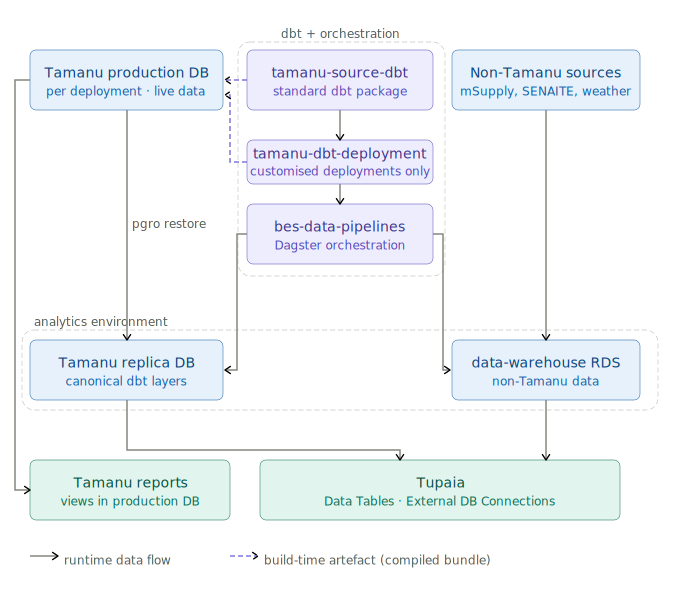

# Data Architecture

| | |
|---|---|
| **Status** | `review` |
| **Owner** | Data Lead (BES) |
| **Last updated** | 2026-05-29 |
| **Supersedes** | - |
| **Related** | `../standards/dbt-conventions.md`, `../standards/derived-elements-conventions.md`, `../standards/tamanu-dbt-conventions.md` |

BES runs Tamanu - an open-source electronic health record - across a range of country and organisational deployments in the Pacific and beyond. Health data from these deployments feeds Tupaia, a platform that visualises health indicators for program managers, ministries of health, and partner organisations.

The problem this architecture solves: **every deployment was modelling its own indicators independently**. The same metric - say, the percentage of hypertensive patients with controlled blood pressure - was being calculated differently in different places, stored in different shapes, and visualised in disconnected dashboards. Numbers that should have been the same weren't, and no one could tell why.

This document describes how we fix that. The core idea is simple: define clinical data and health indicators **once**, in a shared model layer, and have both Tamanu reports and Tupaia dashboards consume that single definition. If the logic changes, it changes in one place. If a new deployment joins, it inherits the same definitions from day one. The same architecture also positions us to enable AI-assisted ad-hoc reporting for end users, treating it as a third consumer of the same canonical layer.

The decisions in this document are the settled architectural choices that make that possible. Convention docs (`dbt-conventions.md`, `derived-elements-conventions.md`, etc.) describe how to apply them day-to-day; this document describes why.

> **Naming note.** Two renames are in flight that affect how older documentation reads.
> - The previous `data-lake` *RDS instance* is being retired and replaced by the `data-warehouse` RDS.
> - The `data-lake` *GitHub repo* is being renamed to **`bes-data-pipelines`** to reflect what it does (Dagster orchestration of dbt pipelines and non-Tamanu modelling).
>
> A third unrelated thing also uses the name: Tupaia's separate `data-lake` service (a Tupaia-side data-broker for the replication-backed pattern being unwound - see D9). This document uses the new names throughout; context disambiguates where the old names appear in code or runbooks.

---

## Contents

This architecture is split across the files in [`data-architecture/`](data-architecture/) for navigation. Start here, then drill into whichever piece you need:

| File | What's there |
|---|---|
| [`data-architecture/decisions.md`](data-architecture/decisions.md) | Numbered architectural decisions D1–D11 — the rules that govern everything else. Cross-referenced as `(D1)`, `(D2)`, … throughout the team's standards and runbooks |
| [`data-architecture/production-promotion.md`](data-architecture/production-promotion.md) | How models reach the three consumption surfaces — Tamanu reports (production), Tupaia dashboards (replica), AI-assisted ad-hoc reporting. Version-skew handling. Replica freshness. Report config mechanics |
| [`data-architecture/phase-0.md`](data-architecture/phase-0.md) | Phase 0 deliverables — what's done, what's pending, target close. Cross-references Linear for live tracking |
| [`data-architecture/open-questions.md`](data-architecture/open-questions.md) | Open questions (OQ-001 through OQ-011) — owners and target phases |
| [`data-architecture/consequences.md`](data-architecture/consequences.md) | Trade-offs the architecture accepts — what gets easier, what costs more, what we deliberately aren't doing |
| [`data-architecture/quick-reference.md`](data-architecture/quick-reference.md) | Developer cheat-sheet — "what layer should I use?" and the materialisation matrix |

---

## North star

One canonical clinical model derived from Tamanu, one shared indicator layer, two presentation platforms (Tamanu reports + Tupaia dashboards) consuming the same definitions.

**Reading the diagram:**
- **Blue** = databases; **purple** = dbt projects / orchestration; **green** = data consumers
- **Solid arrows** = runtime data flows; **dashed purple** = build-time compiled SQL bundles promoted to production at each release
- `tamanu-dbt-deployment` exists only for deployments with customisation; the majority run `tamanu-source-dbt` directly
- Tamanu reports are views in production (live data); Tupaia queries replicas + data-warehouse (bounded by replica freshness)

Every indicator appearing in both a Tamanu report and a Tupaia dashboard has its logic defined once, in a `metric__` model, and reused by both - by construction, not by convention.

### Teams and ownership

Several BES teams own different parts of the pipeline. Useful context for reading the rest of this document:

| Team | Scope | Touches in this architecture |
|---|---|---|
| **Data team** | Owns the data pipelines, modelling, and analytics surface. | `tamanu-source-dbt`, `tamanu-dbt-<deployment>` projects, `bes-data-pipelines` orchestration, `metric__` / `lkp__` / `der__` / `ds__` / `can__` definitions, indicator catalogues, deployment override application during upgrades |
| **DevOps** | Manages the replica infrastructure and underlying database operations. | Replica infrastructure, `data-warehouse` RDS provisioning |
| **Ops** | Manages Tamanu deployments. | Clone deployment infrastructure (the upgrade-validation environments) |
| **Tamanu engineering** | Builds Tamanu the application; produces releases. | Tamanu source schema (`public.*`), release deployment infrastructure (the environment the reporting schema is built against) |
| **Tupaia engineering** | Builds Tupaia the platform. | Tupaia admin panel and import capabilities, map rendering, visual design system (palettes, typography, layout chrome), Tupaia microservices |

**Operational boundaries:**
- **Replica issues** (data not refreshing, schema not persisting) → DevOps
- **Clone deployment issues** (upgrade validation environments) → Ops
- **Tamanu schema changes or source-of-truth bugs in `public.*`** → Tamanu engineering
- **Tupaia platform issues** (admin panel bugs, map rendering, import capability) → Tupaia engineering
- **Reporting schema** (`reporting.*` views in production, defined by `tamanu-source-dbt` or `tamanu-dbt-<deployment>` models that ship via the compiled bundle) → Data team
- **Everything else in the data pipeline** → Data team

Cross-team work is scoped as separate asks rather than landed into the data team's backlog.

### Where things live

| | Database | dbt repo | Notes |
|---|---|---|---|
| Tamanu source data (live) | Tamanu production DB (per deployment) | - | `public.*` - written to by the Tamanu app |
| Tamanu source data (analytics) | Tamanu replica DB (per deployment) | - | `public.*` - periodically updated replica (DevOps-owned). See "Replica freshness" |
| `reporting.*` views in production | Tamanu production DB | `tamanu-source-dbt` or `tamanu-dbt-<deployment>` (compiled bundle) | Tamanu reports run here. See [`data-architecture/production-promotion.md`](data-architecture/production-promotion.md) |
| `ref__` / `lkp__` / `can__` / `der__` / `metric__` / `ds__` (Tamanu-derived) | Tamanu replica DB | `tamanu-source-dbt` or `tamanu-dbt-<deployment>` | The transitive closure of `models/reports/` also ships to production via the compiled bundle |
| Non-Tamanu source data | `data-warehouse` RDS | - | mSupply (supply chain), SENAITE (LIMS), weather, … |
| Non-Tamanu modelled data | `data-warehouse` RDS | `bes-data-pipelines` repo | Canonical layer pattern TBD - see OQ-002 |
| Orchestration | - | `bes-data-pipelines` repo | Dagster: dbt scheduling, monitoring, alerting. References `tamanu-source-dbt` directly (standard) or `tamanu-dbt-<deployment>` (for customised deployments) |

---

## References

- [`../standards/dbt-conventions.md`](../standards/dbt-conventions.md) — dbt layering, naming, materialisation
- [`../standards/derived-elements-conventions.md`](../standards/derived-elements-conventions.md) — `der__` layer pattern reference
- [`../runbooks/new-derived-element.md`](../runbooks/new-derived-element.md) — operational guide that this architecture extends
- [`../glossary.md`](../glossary.md) — terminology (OMOP, Tamanu, Tupaia, the three `data-lake`s, …)
- OMOP CDM v5.4: <https://ohdsi.github.io/CommonDataModel/>
- OHDSI Athena (vocabulary lookup): <https://athena.ohdsi.org/>
- WHO SMART Guidelines: <https://www.who.int/teams/digital-health-and-innovation/smart-guidelines>
- WHO Digital Adaptation Kits (DAKs): <https://www.who.int/teams/digital-health-and-innovation/smart-guidelines/digital-adaptation-kits>
